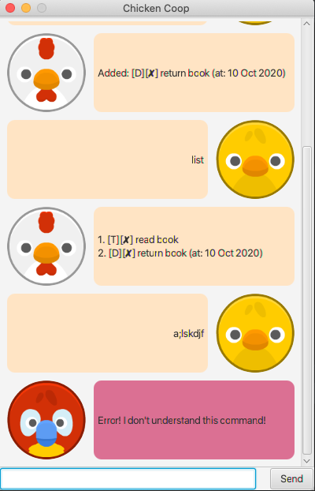
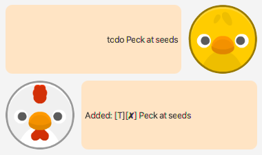
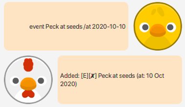
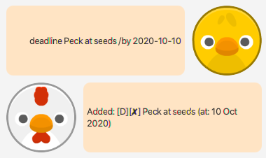
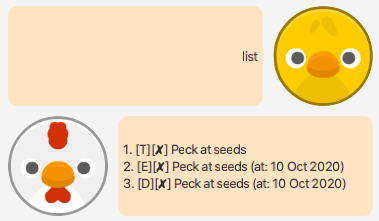
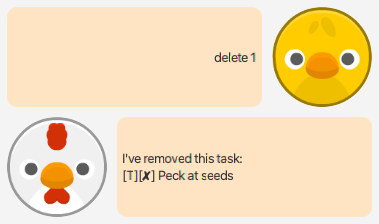
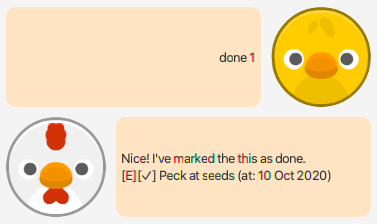
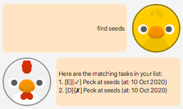
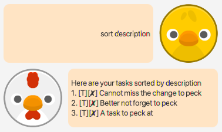

# Chicken Coop User Guide

## Features 

### Create ToDo 
Create a todo task that can be marked as complete.

## Usage

### `todo DESCRIPTION` - Creates a todo with DESCRIPTION as the description

Example of usage: 

`todo Peck at seeds`

Expected outcome:

### Create Event 
Create a event task that occurs at a certain time that can be marked as complete.

## Usage

### `event DESCRIPTION /at TIME` - Creates a event with DESCRIPTION as the description and occurs at TIME

Example of usage: 

`event Peck at seeds /at 2020-10-10`

Expected outcome:

### Create Deadline 
Create a task with a specified deadline that can be marked as complete.

## Usage

### `deadline DESCRIPTION /by TIME` - Creates a task with DESCRIPTION as the description and deadline on TIME

Example of usage: 

`deadline Peck at seeds /by 2020-10-10`

Expected outcome:

### List All Tasks 
Shows all the tasks currently tracked.

## Usage

### `list` - Shows all the tasks currently tracked

Example of usage: 

`todo Peck at seeds`

Expected outcome:

### Delete a Task 
Delete a task that was previously added.

## Usage

### `delete TASK_NUMBER` - Deletes task with task number TASK_NUMBER from the list

Example of usage: 

`delete 1`

Expected outcome:

### Complete a Task
Mark an added task as completed/done.

## Usage

### `done TASK_NUMBER` - Marks the task with task number TASK_NUMBER from the list as completed

Example of usage: 

`done 1`

Expected outcome:

### Find a Task
Shows all tasks that contain the specified text.

## Usage

### `find TEXT_TO_FIND` - Shows all tasks on the list that contains the text TEXT_TO_FIND

Example of usage: 

`find seeds`

Expected outcome:

### Sort the Task List
Sort the task list according to the description or date.

## Usage

### `sort description/date [/order ascending]` - Sorts the task list by description or date. Optionally choose to sort in ascending order

Example of usage: 

`sort description`

Expected outcome:

Example of usage: 

`sort date`

Expected outcome:

Example of usage: 

`sort date /order ascending`

Expected outcome:

### Exit the Program
Exit the program.

## Usage

### `bye` - Exits the program

Example of usage: 

`bye`

Expected outcome:

The program exits.

# Saving and Loading
Tasks are saved in the `data.txt` file in the `data/` directory.
Tasks are also loaded from this file. The file can be edited or deleted
as desired by the user.

# Acknowledgements
Images obtained from https://www.kenney.nl/assets/animal-pack-redux